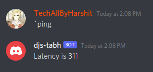
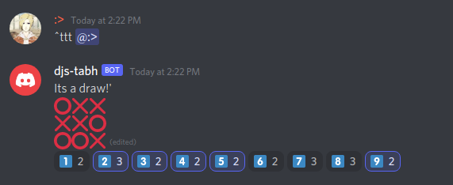

# A library to make your discord bot easily.

`djs-tabh` is a simple package to easily create a discord.js bot.

# Documentation

Install the package

```bash
$ npm install djs-tabh
```

Importing the package

```js
const tabh = require("djs-tabh");
```

## Using the features

- `ping`

```js
const { ping } = require("djs-tabh");

ping({
  message: message, // the message object. required
  client: bot // your client object. required
});

```

> Output:
>
> 

- `tictactoe`

```js
const { tictactoe } = require("djs-tabh");

tictactoe({
  message: message, // the message object. required
  player1: message.author, // player 1, required (user object)
  player2: message.mentions.users.first() // player 2, required (user object)
});

```

> Output:
>
> 


